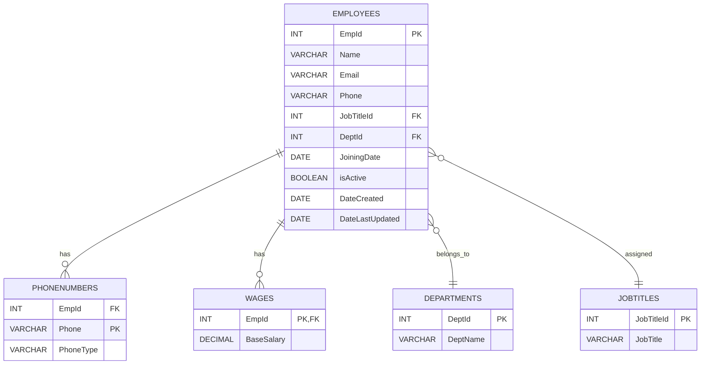

# EmployeesDB Documentation (MySQL)

This document provides an overview of the **Employees Database**, including table structures, ER diagram, SQL scripts, and example queries for HR operations and reporting.

---

## 📑 Database Tables

### Employees
| Column Name      | Type      | Size | Constraint   | Default       |
|------------------|-----------|------|--------------|---------------|
| EmpId           | INT       |      | PK           |               |
| Name            | VARCHAR   | 50   | NOT NULL     |               |
| Email           | VARCHAR   | 70   | NOT NULL     |               |
| Phone           | VARCHAR   | 20   |              |               |
| JobTitleId      | INT       |      | FK           |               |
| DeptId          | INT       |      | FK           |               |
| JoiningDate     | DATE      |      |              |               |
| isActive        | BOOLEAN   |      |              | TRUE          |
| DateCreated     | DATE      |      |              | SYSTEM DATE   |
| DateLastUpdated | DATE      |      |              |               |

### Departments
| Column Name | Type    | Size | Constraint   |
|-------------|---------|------|--------------|
| DeptId     | INT     |      | PK           |
| DeptName   | VARCHAR | 100  | NOT NULL     |

### JobTitles
| Column Name | Type    | Size | Constraint   |
|-------------|---------|------|--------------|
| JobTitleId | INT     |      | PK           |
| JobTitle   | VARCHAR | 100  | NOT NULL     |

### PhoneNumbers
| Column Name | Type    | Size | Constraint   |
|-------------|---------|------|--------------|
| EmpId      | INT     |      | FK           |
| Phone      | VARCHAR | 20   | PK           |
| PhoneType  | VARCHAR | 20   | NOT NULL     |

### Wages
| Column Name | Type     | Size   | Constraint |
|-------------|----------|--------|------------|
| EmpId      | INT      |        | PK, FK     |
| BaseSalary | DECIMAL  | (10,2) |            |

---

## 🗂️ ER Diagram



---

## ⚙️ SQL Scripts

### 1. Create Database and Tables
```sql
CREATE DATABASE EmployeesDB;
USE EmployeesDB;

CREATE TABLE Departments (
    deptId INT PRIMARY KEY,
    deptName VARCHAR(100) NOT NULL
);

CREATE TABLE JobTitles (
    jobTitleId INT PRIMARY KEY,
    jobTitle VARCHAR(100) NOT NULL
);

CREATE TABLE Employees (
    empId INT PRIMARY KEY,
    name VARCHAR(50) NOT NULL,
    email VARCHAR(70) NOT NULL,
    jobTitleId INT,
    deptId INT,
    joiningDate DATE,
    isActive BOOLEAN DEFAULT TRUE,
    dateCreated DATE DEFAULT CURRENT_DATE,
    dateLastUpdated DATE,
    FOREIGN KEY (jobTitleId) REFERENCES JobTitles(jobTitleId),
    FOREIGN KEY (deptId) REFERENCES Departments(deptId)
);

CREATE TABLE Wages (
    empId INT PRIMARY KEY,
    baseSalary DECIMAL(10,2),
    FOREIGN KEY (empId) REFERENCES Employees(empId)
);

CREATE TABLE PhoneNumbers (
    empId INT,
    phone VARCHAR(20),
    phoneType VARCHAR(20) NOT NULL,
    PRIMARY KEY (phone),
    FOREIGN KEY (empId) REFERENCES Employees(empId)
);
```

### 2. Insert Sample Data
```sql
INSERT INTO Departments VALUES (1, 'Engineering'), (2, 'Finance'), (3, 'Marketing');
INSERT INTO JobTitles VALUES (1, 'Software Engineer'), (2, 'HR Manager'), (3, 'Marketing Executive');

INSERT INTO Employees (empId, name, email, jobTitleId, deptId, joiningDate, isActive, dateCreated) VALUES
(1, 'Uma Anderson', 'uma.anderson1@example.com', 2, 2, '2023-02-02', TRUE, CURRENT_DATE),
(2, 'Nina Martinez', 'nina.martinez2@example.com', 3, 3, '2023-03-03', TRUE, CURRENT_DATE),
(3, 'Steve Rodriguez', 'steve.rodriguez3@example.com', 1, 1, '2023-04-04', TRUE, CURRENT_DATE),
(4, 'Ian Martinez', 'ian.martinez4@example.com', 2, 2, '2023-05-05', TRUE, CURRENT_DATE),
(5, 'George Robinson', 'george.robinson5@example.com', 3, 3, '2023-06-06', TRUE, CURRENT_DATE),
(6, 'Edward Robinson', 'edward.robinson6@example.com', 1, 1, '2023-07-07', TRUE, CURRENT_DATE),
(7, 'Wendy Johnson', 'wendy.johnson7@example.com', 2, 2, '2023-08-08', TRUE, CURRENT_DATE),
(8, 'Rachel Robinson', 'rachel.robinson8@example.com', 3, 3, '2023-09-09', TRUE, CURRENT_DATE),
(9, 'Xavier Harris', 'xavier.harris9@example.com', 1, 1, '2023-10-10', TRUE, CURRENT_DATE),
(10, 'Hannah Garcia', 'hannah.garcia10@example.com', 2, 2, '2023-11-11', TRUE, CURRENT_DATE),
(11, 'Jane Smith', 'jane.smith11@example.com', 3, 3, '2023-12-12', TRUE, CURRENT_DATE),
(12, 'Zane Anderson', 'zane.anderson12@example.com', 1, 1, '2023-01-13', TRUE, CURRENT_DATE),
(13, 'Rachel Clark', 'rachel.clark13@example.com', 2, 2, '2023-02-14', TRUE, CURRENT_DATE),
(14, 'Laura Jackson', 'laura.jackson14@example.com', 3, 3, '2023-03-15', TRUE, CURRENT_DATE),
(15, 'Charlie Clark', 'charlie.clark15@example.com', 1, 1, '2023-04-16', TRUE, CURRENT_DATE),
(16, 'Steve Anderson', 'steve.anderson16@example.com', 2, 2, '2023-05-17', TRUE, CURRENT_DATE),
(17, 'George Martin', 'george.martin17@example.com', 3, 3, '2023-06-18', TRUE, CURRENT_DATE),
(18, 'Edward Martinez', 'edward.martinez18@example.com', 1, 1, '2023-07-19', TRUE, CURRENT_DATE),
(19, 'Yara Lewis', 'yara.lewis19@example.com', 2, 2, '2023-08-20', TRUE, CURRENT_DATE),
(20, 'Alice Martinez', 'alice.martinez20@example.com', 3, 3, '2023-09-21', TRUE, CURRENT_DATE),
(21, 'Jane Harris', 'jane.harris21@example.com', 1, 1, '2023-10-22', TRUE, CURRENT_DATE),
(22, 'Kevin Jackson', 'kevin.jackson22@example.com', 2, 2, '2023-11-23', TRUE, CURRENT_DATE),
(23, 'Zane Harris', 'zane.harris23@example.com', 3, 3, '2023-12-24', TRUE, CURRENT_DATE),
(24, 'Fiona Johnson', 'fiona.johnson24@example.com', 1, 1, '2023-01-25', TRUE, CURRENT_DATE),
(25, 'Quentin Anderson', 'quentin.anderson25@example.com', 2, 2, '2023-02-26', TRUE, CURRENT_DATE),
(26, 'Tina Harris', 'tina.harris26@example.com', 3, 3, '2023-03-27', TRUE, CURRENT_DATE),
(27, 'Nina Lee', 'nina.lee27@example.com', 1, 1, '2023-04-28', TRUE, CURRENT_DATE),
(28, 'Fiona Martinez', 'fiona.martinez28@example.com', 2, 2, '2023-05-01', TRUE, CURRENT_DATE),
(29, 'Tina Anderson', 'tina.anderson29@example.com', 3, 3, '2023-06-02', TRUE, CURRENT_DATE),
(30, 'Diana White', 'diana.white30@example.com', 1, 1, '2023-07-03', TRUE, CURRENT_DATE),
(31, 'Laura Taylor', 'laura.taylor31@example.com', 2, 2, '2023-08-04', TRUE, CURRENT_DATE),
(32, 'Bob Jackson', 'bob.jackson32@example.com', 3, 3, '2023-09-05', TRUE, CURRENT_DATE),
(33, 'Quentin Johnson', 'quentin.johnson33@example.com', 1, 1, '2023-10-06', TRUE, CURRENT_DATE),
(34, 'Steve Brown', 'steve.brown34@example.com', 2, 2, '2023-11-07', TRUE, CURRENT_DATE),
(35, 'Uma Thompson', 'uma.thompson35@example.com', 3, 3, '2023-12-08', TRUE, CURRENT_DATE),
(36, 'Jane Taylor', 'jane.taylor36@example.com', 1, 1, '2023-01-09', TRUE, CURRENT_DATE),
(37, 'Bob Martin', 'bob.martin37@example.com', 2, 2, '2023-02-10', TRUE, CURRENT_DATE),
(38, 'Kevin Smith', 'kevin.smith38@example.com', 3, 3, '2023-03-11', TRUE, CURRENT_DATE),
(39, 'George Anderson', 'george.anderson39@example.com', 1, 1, '2023-04-12', TRUE, CURRENT_DATE),
(40, 'Tina Lewis', 'tina.lewis40@example.com', 2, 2, '2023-05-13', TRUE, CURRENT_DATE),
(41, 'Alice Clark', 'alice.clark41@example.com', 3, 3, '2023-06-14', TRUE, CURRENT_DATE),
(42, 'Laura Smith', 'laura.smith42@example.com', 1, 1, '2023-07-15', TRUE, CURRENT_DATE),
(43, 'Kevin Hall', 'kevin.hall43@example.com', 2, 2, '2023-08-16', TRUE, CURRENT_DATE),
(44, 'Jane Johnson', 'jane.johnson44@example.com', 3, 3, '2023-09-17', TRUE, CURRENT_DATE),
(45, 'Kevin Taylor', 'kevin.taylor45@example.com', 1, 1, '2023-10-18', TRUE, CURRENT_DATE),
(46, 'Oscar Hall', 'oscar.hall46@example.com', 2, 2, '2023-11-19', TRUE, CURRENT_DATE),
(47, 'Uma Walker', 'uma.walker47@example.com', 3, 3, '2023-12-20', TRUE, CURRENT_DATE),
(48, 'Nina Garcia', 'nina.garcia48@example.com', 1, 1, '2023-01-21', TRUE, CURRENT_DATE),
(49, 'Oscar Anderson', 'oscar.anderson49@example.com', 2, 2, '2023-02-22', TRUE, CURRENT_DATE),
(50, 'Zane White', 'zane.white50@example.com', 3, 3, '2023-03-23', TRUE, CURRENT_DATE),
(51, 'Charlie Harris', 'charlie.harris51@example.com', 1, 1, '2023-04-24', TRUE, CURRENT_DATE),
(52, 'Michael Anderson', 'michael.anderson52@example.com', 2, 2, '2023-05-25', TRUE, CURRENT_DATE),
(53, 'Bob Rodriguez', 'bob.rodriguez53@example.com', 3, 3, '2023-06-26', TRUE, CURRENT_DATE),
(54, 'Zane Brown', 'zane.brown54@example.com', 1, 1, '2023-07-27', TRUE, CURRENT_DATE),
(55, 'Quentin Robinson', 'quentin.robinson55@example.com', 2, 2, '2023-08-28', TRUE, CURRENT_DATE),
(56, 'Victor Thomas', 'victor.thomas56@example.com', 3, 3, '2023-09-01', TRUE, CURRENT_DATE),
(57, 'Jane Martin', 'jane.martin57@example.com', 1, 1, '2023-10-02', TRUE, CURRENT_DATE),
(58, 'Jane Hall', 'jane.hall58@example.com', 2, 2, '2023-11-03', TRUE, CURRENT_DATE),
(59, 'Diana Anderson', 'diana.anderson59@example.com', 3, 3, '2023-12-04', TRUE, CURRENT_DATE),
(60, 'Quentin Brown', 'quentin.brown60@example.com', 1, 1, '2023-01-05', TRUE, CURRENT_DATE),
(61, 'Victor Rodriguez', 'victor.rodriguez61@example.com', 2, 2, '2023-02-06', TRUE, CURRENT_DATE),
(62, 'George Garcia', 'george.garcia62@example.com', 3, 3, '2023-03-07', TRUE, CURRENT_DATE),
(63, 'Steve Lee', 'steve.lee63@example.com', 1, 1, '2023-04-08', TRUE, CURRENT_DATE),
(64, 'Uma Lewis', 'uma.lewis64@example.com', 2, 2, '2023-05-09', TRUE, CURRENT_DATE),
(65, 'Laura Lee', 'laura.lee65@example.com', 3, 3, '2023-06-10', TRUE, CURRENT_DATE),
(66, 'Steve Taylor', 'steve.taylor66@example.com', 1, 1, '2023-07-11', TRUE, CURRENT_DATE),
(67, 'Michael Harris', 'michael.harris67@example.com', 2, 2, '2023-08-12', TRUE, CURRENT_DATE),
(68, 'Kevin Johnson', 'kevin.johnson68@example.com', 3, 3, '2023-09-13', TRUE, CURRENT_DATE),
(69, 'Diana Lee', 'diana.lee69@example.com', 1, 1, '2023-10-14', TRUE, CURRENT_DATE),
(70, 'Yara Rodriguez', 'yara.rodriguez70@example.com', 2, 2, '2023-11-15', TRUE, CURRENT_DATE),
(71, 'Zane Jackson', 'zane.jackson71@example.com', 3, 3, '2023-12-16', TRUE, CURRENT_DATE),
(72, 'Wendy Martin', 'wendy.martin72@example.com', 1, 1, '2023-01-17', TRUE, CURRENT_DATE),
(73, 'Oscar Taylor', 'oscar.taylor73@example.com', 2, 2, '2023-02-18', TRUE, CURRENT_DATE),
(74, 'Victor White', 'victor.white74@example.com', 3, 3, '2023-03-19', TRUE, CURRENT_DATE),
(75, 'Nina Thompson', 'nina.thompson75@example.com', 1, 1, '2023-04-20', TRUE, CURRENT_DATE),
(76, 'Wendy Walker', 'wendy.walker76@example.com', 2, 2, '2023-05-21', TRUE, CURRENT_DATE),
(77, 'Paula Lee', 'paula.lee77@example.com', 3, 3, '2023-06-22', TRUE, CURRENT_DATE),
(78, 'Fiona White', 'fiona.white78@example.com', 1, 1, '2023-07-23', TRUE, CURRENT_DATE),
(79, 'Nina Harris', 'nina.harris79@example.com', 2, 2, '2023-08-24', TRUE, CURRENT_DATE),
(80, 'Edward Martin', 'edward.martin80@example.com', 3, 3, '2023-09-25', TRUE, CURRENT_DATE),
(81, 'Bob Walker', 'bob.walker81@example.com', 1, 1, '2023-10-26', TRUE, CURRENT_DATE),
(82, 'Rachel Garcia', 'rachel.garcia82@example.com', 2, 2, '2023-11-27', TRUE, CURRENT_DATE),
(83, 'Kevin Lee', 'kevin.lee83@example.com', 3, 3, '2023-12-28', TRUE, CURRENT_DATE),
(84, 'Diana Johnson', 'diana.johnson84@example.com', 1, 1, '2023-01-01', TRUE, CURRENT_DATE),
(85, 'Nina Lewis', 'nina.lewis85@example.com', 2, 2, '2023-02-02', TRUE, CURRENT_DATE),
(86, 'Michael Rodriguez', 'michael.rodriguez86@example.com', 3, 3, '2023-03-03', TRUE, CURRENT_DATE),
(87, 'Edward White', 'edward.white87@example.com', 1, 1, '2023-04-04', TRUE, CURRENT_DATE),
(88, 'Steve Clark', 'steve.clark88@example.com', 2, 2, '2023-05-05', TRUE, CURRENT_DATE),
(89, 'Bob White', 'bob.white89@example.com', 3, 3, '2023-06-06', TRUE, CURRENT_DATE),
(90, 'Victor Lewis', 'victor.lewis90@example.com', 1, 1, '2023-07-07', TRUE, CURRENT_DATE),
(91, 'Jane Lee', 'jane.lee91@example.com', 2, 2, '2023-08-08', TRUE, CURRENT_DATE),
(92, 'Ian Garcia', 'ian.garcia92@example.com', 3, 3, '2023-09-09', TRUE, CURRENT_DATE),
(93, 'Xavier Taylor', 'xavier.taylor93@example.com', 1, 1, '2023-10-10', TRUE, CURRENT_DATE),
(94, 'Victor Jackson', 'victor.jackson94@example.com', 2, 2, '2023-11-11', TRUE, CURRENT_DATE),
(95, 'Tina Thompson', 'tina.thompson95@example.com', 3, 3, '2023-12-12', TRUE, CURRENT_DATE),
(96, 'Uma Taylor', 'uma.taylor96@example.com', 1, 1, '2023-01-13', TRUE, CURRENT_DATE),
(97, 'Bob Thompson', 'bob.thompson97@example.com', 2, 2, '2023-02-14', TRUE, CURRENT_DATE),
(98, 'Rachel Rodriguez', 'rachel.rodriguez98@example.com', 3, 3, '2023-03-15', TRUE, CURRENT_DATE),
(99, 'Paula Harris', 'paula.harris99@example.com', 1, 1, '2023-04-16', TRUE, CURRENT_DATE),
(100, 'George Jackson', 'george.jackson100@example.com', 2, 2, '2023-05-17', TRUE, CURRENT_DATE);


INSERT INTO Wages VALUES (1, 90000), (2, 75000);
INSERT INTO PhoneNumbers VALUES (1, '1234-100001', 'Mobile'), (1, '1234-100002', 'Work');
```

---

## 📊 Useful SELECT Queries

### List Employees with Department and Job Titles
```sql
SELECT e.empId, e.name, jt.jobTitle, d.deptName, w.baseSalary
FROM Employees e
INNER JOIN JobTitles jt ON e.jobTitleId = jt.jobTitleId
INNER JOIN Departments d ON e.deptId = d.deptId
INNER JOIN Wages w ON e.empId = w.empId;
```

### HR Report: Employee Count and Total Salary per Department
```sql
SELECT d.deptName, COUNT(e.empId) AS EmployeeCount, SUM(w.baseSalary) AS TotalSalary
FROM Employees e
INNER JOIN Departments d ON e.deptId = d.deptId
INNER JOIN Wages w ON e.empId = w.empId
GROUP BY d.deptName;
```

### Find Employees with Salary Between 80k–90k
```sql
SELECT e.empId, e.name, w.baseSalary
FROM Employees e
INNER JOIN Wages w ON e.empId = w.empId
WHERE w.baseSalary BETWEEN 80000 AND 90000;
```

### Search Employees by Name Pattern
```sql
SELECT * FROM Employees WHERE name LIKE 'Jan%';
```

### Highest Salary Amount
```sql
SELECT MAX(baseSalary) AS HighestSalary
FROM Wages;
```

### Employee record (empid, baseSalary) who has Highest Salary
```sql
SELECT empId, baseSalary
FROM Wages
WHERE baseSalary = (SELECT MAX(baseSalary) FROM Wages);
```

### Employee record (all fields) who has Highest Salary
```sql
SELECT e.empId, e.name, e.email, jt.jobTitle, d.deptName, w.baseSalary
FROM Employees e
INNER JOIN Wages w ON e.empId = w.empId
INNER JOIN JobTitles jt ON e.jobTitleId = jt.jobTitleId
INNER JOIN Departments d ON e.deptId = d.deptId
WHERE w.baseSalary = (SELECT MAX(baseSalary) FROM Wages);
```

### Second Highest Salary
```sql
SELECT empId, baseSalary FROM Wages
WHERE baseSalary = (
    SELECT MAX(baseSalary) FROM Wages
    WHERE baseSalary < (SELECT MAX(baseSalary) FROM Wages)
);
```

---

## 🗑️ DELETE Operations
```sql
DELETE FROM Employees WHERE deptId = 3 AND jobTitleId = 2;
```

---

## ✏️ UPDATE Operations
```sql
-- Make employee inactive
UPDATE Employees SET isActive = FALSE WHERE empId = 1;

-- Change employee department
UPDATE Employees SET deptId = 2 WHERE empId = 1;

-- Rename a job title
UPDATE JobTitles SET jobTitle = 'Senior Software Engineer' WHERE jobTitleId = 1;
```

---

## 🛠️ Additional DDL & DML

### Create Backup Table
```sql
CREATE TABLE Employees_bkp_20250828 SELECT * FROM Employees;
```

### Truncate Tables
```sql
TRUNCATE TABLE Employees;
TRUNCATE TABLE Departments;
```

### Drop Tables
```sql
DROP TABLE IF EXISTS Employees;
DROP TABLE IF EXISTS Departments;
```

---

## ✅ Transactions
```sql
START TRANSACTION;
UPDATE Wages SET baseSalary = baseSalary + 10000 WHERE empId > 0;
COMMIT;

-- Or rollback if needed
ROLLBACK;
```

---

📌 **Note**: This database is designed primarily for HR operations and reporting, with emphasis on employee records, salary details, and organizational structure.

